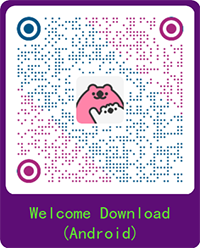

<h1 align="center">
  <br/>
  React Native Awesome Navigation
</h1>

The react-native-navigation-5e is a native navigation based on iOS UIViewController and Android Activity/Fragment. The purpose we are doing this is that the popular [react-navigation](https://reactnavigation.org)'s performance cannot satify our react-navie based application, especially on Android. Thanks to Khan Academy's [Our Transition to React Native](https://blog.khanacademy.org/our-transition-to-react-native/) give us inspiration, we decide to develop this project, and it has been already use in our commercial application, and it will be keep optimizing and updating.

[中文文档](https://github.com/Project5E/react-native-navigation-5e/blob/master/README-zh.md)

## Installation

```sh
yarn add react-native-navigation-5e

# npm install react-native-navigation-5e

For Android link package dependencies in settings.gradle

include ':app', ':react-native-navigation-5e-android'

project(':react-native-navigation-5e-android').projectDir = new File(rootProject.projectDir, '../node_modules/react-native-navigation-5e/android')
```

## Usage

```ts
import { registerComponent, setRoot } from 'react-native-navigation-5e';

// setting global style
setStyle({
  hideBackTitle: true,
  hideNavigationBarShadow: true,
  navigationBarColor: '#FFFFFF',
  navigationBarItemColor: 'FF84A9',
  tabBarColor: '#FFFFFF',
  tabBarItemColor: '#FF84A9',
  backIcon: Image.resolveAssetSource(CloseIcon),
})

beforeRegister()

// register component，and set root page

registerComponent('Home', Home);
registerComponent('Setting', Setting);
registerComponent('Detail', Detail);
registerComponent('Present', Present);
registerComponent('NoNavigationBar', NoNavigationBar);

setRoot({
  root: {
    tabs: {
      children: [
        {
          component: 'Home',
          title: 'MainPage',
          icon: Image.resolveAssetSource(require('./src/image/Home.png')),
        },
        {
          component: 'Setting',
          title: 'Setting',
          icon: Image.resolveAssetSource(require('./src/image/Profile.png')),
        },
      ],
    },
  },
});
```

Support native page and RN page mash up
Currently offer two native style setting
Setting title bar title and whether hide title bar or not 
```ts
Home.navigationItem = {
  title: 'MainPage',
  hideNavigationBar: false,
}

```

### iOS
Bridge should be record in AppDelegate.   
At same time register relevant native ViewController，the ViewController should inherit ALCNativeViewController.
```
  RCTBridge *bridge = [[RCTBridge alloc] initWithDelegate:self launchOptions:launchOptions];
  [ALCNavigationManager shared].bridge = bridge;
  [[ALCNavigationManager shared] registerNativeModule:@"NativeViewController" forController:[ThisIsViewController class]];
```

## Navigation

Currently support `push`, `pop`, `popToRoot`, `present`, `dismiss`, `switchTab`

`push` pass parameter
```ts
props.navigator.push('NativeViewController', { title: 'Native' })
```

`push` receive parameter
```ts
const resp = await props.navigator.push('Detail')
```

Set value before `pop`
```ts
props.navigator.setResult({qwe: 123})
props.navigator.pop()
```
The `present` is similar with push, the 2nd is parameter, 3rd parameter is full screen or not.
```ts
props.navigator.present('Present', undefined, true)
```

`dismiss` present
```
props.navigator.dismiss()
```

`switchTab` is for switch tab to position.
```
props.navigator.switchTab(0)
```

Every page will be enrolled their own navigator, navigator have a unique screenID and module name ,through navigator to manipulate page.

## Global style
Currently include styles follows，continue updating.
```ts
interface GlobalStyle {
  backIcon?: {uri: string} // set back icon
  hideNavigationBarShadow?: boolean // if hide tool bar shadow
  hideBackTitle?: boolean // if hide title next to back icon
  navigationBarColor?: string // tool bar background color
  navigationBarItemColor?: string // tool bar item color
  tabBarColor?: string // tabbar background color
  tabBarItemColor?: string // tabbar picked color
  tabBarDotColor?: string // tabbar dot color
}
```

Example
```ts
setStyle({
  hideBackTitle: true,
  hideNavigationBarShadow: true,
  navigationBarColor: '#FFFFFF',
  navigationBarItemColor: 'FF84A9',
  tabBarColor: '#FFFFFF',
  tabBarItemColor: '#FF84A9',
  backIcon: Image.resolveAssetSource(CloseIcon),
})
```

Toolbar can be set Badge as well.

```ts
setTabBadge([
  {
    index: 0,
    hidden: false,
    dot: true,
  },
  {
    index: 1,
    text: '1199',
    hidden: false,
  },
])
```

```ts
export interface TabBadge {
  index: number
  hidden: boolean
  text?: string
  dot?: boolean
}
```

Color is only support hexadecimal string, not support color string like 'red'.

## Lifecycle

Each page has their own hooks to check if the page is focused.
```ts
useVisibleEffect(
    props.screenID,
    useCallback(() => {
      console.log(`${props.screenID} is visible`)
      return () => {
        console.log(`${props.screenID} is gone`)
      }
    }, [])
  )
```

## Support DeepLink

Adding route when register
```ts
registerComponent('Home', Home, '/home')
registerComponent('Setting', Setting)
```

Activiting at first page
```ts
  useEffect(() => {
    router.activate('hulaqinzi://')
    return () => {
      router.inactivate()
    }
  }, [])
```

```ts
Router.open('hulaqinzi://home?key=value')
```
 Link address will be parsed as /home，paramter {key: value}，and push to Home page and pass parameter.

## hooks

### useResult

This is for pass parameter when a page pop back.

```ts
  useResult(props.screenID, (data) => {
    console.log(data);
  })
```
Type can be return ok or cancel.

Ok means back with value，cancel normal back.

Data is back value.

### useReClick

Resopse click tabbar repeatly，this is only for each tab bar first page.

```ts
  useReClick(props.screenID, () => {
    console.log('reclick');
  })
```

### Usage on commercial application

<h3 align="center">
  <br/>
</h3>

## Contributing

See the [contributing guide](CONTRIBUTING.md) to learn how to contribute to the repository and the development workflow.

[Logo designed by jemastock / Freepik](http://www.freepik.com)

## License

[MIT LISCENSE](https://github.com/Project5E/react-native-navigation-5e/blob/master/LICENSE)
