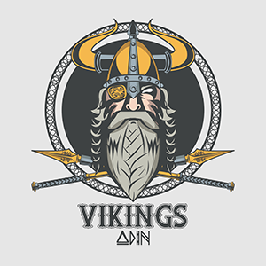

<h1 align="center">
  <br/>
  React Native Awesome Navigation
</h1>

# Introduction ([中文](/docs/README_zh.md))

The react-native-awesome-navigation is a native navigation based on iOS UIViewController and Android Activity/Fragment.
The purpose we are doing this is that the popular [react-navigation](https://reactnavigation.org)'s performance cannot
satify our react-navie based application, especially on Android. Thanks to Khan
Academy's [Our Transition to React Native](https://blog.khanacademy.org/our-transition-to-react-native/) give us
inspiration, we decide to develop this project, and it has been already use in our commercial application, and it will
be keep optimizing and updating.

Before you decided to use this, feel free to play the example first, just read this [instruct to play example](https://github.com/Project5E/react-native-awesome-navigation/wiki)

# Installation

```sh
yarn add react-native-awesome-navigation
```

or

```sh
npm install react-native-awesome-navigation
```

## Build configuration on Android

Ensure your build files match the following requirements:

1. (React Native 0.59 and lower) Define the `react-native-awesome-navigation` project in `android/settings.gradle`:

```groovy
...
include ':react-native-awesome-navigation'
project(':react-native-awesome-navigation').projectDir = new File(rootProject.projectDir, '../node_modules/react-native-awesome-navigation/android')
```

2. (React Native 0.59 and lower) Add the `react-native-awesome-navigation` as an dependency of your app
   in `android/app/build.gradle`:

```groovy
...
dependencies {
  ...
  implementation project(':react-native-awesome-navigation')
}
```

## Build configuration on iOS

Using React Native Link (React Native 0.59 and lower)

Run `react-native link react-native-awesome-navigation` after which you should be able to use this library on iOS.

# Documentation

- [Android](/docs/Android.md)

- [iOS](/docs/iOS.md)

# Usage

Put following code in `index` file or you can also copy following code to individual file and import it in `index` also works, as you wish.

```ts
import { Register, setStyle } from 'react-native-awesome-navigation';

import Home from './src/Home'
import TabBar from './src/TabBar'
import Setting from './src/Setting'

// setting global style
setStyle({
  hideBackTitle: true,
  hideNavigationBarShadow: true,
  navigationBarColor: '#FFFFFF',
  navigationBarItemColor: 'FF84A9',
  tabBarColor: '#FFFFFF',
  tabBarItemColor: '#FF84A9',
  backIcon: Image.resolveAssetSource(require('./src/image/Profile.png')),
})

Register.beforeRegister()

// register component，and set root page

Register.registerComponent('Home', Home);
Register.registerComponent('Setting', Setting);
Register.registerComponent('Detail', Detail);
Register.registerComponent('Present', Present);
Register.registerComponent('NoNavigationBar', NoNavigationBar);

Register.setRoot({
 root: {
    tabs: {
        children: [
          {
            stack: {
              root: {
                screen: {
                  moduleName: 'Home',
                },
              },
              options: {title: '主页', icon: Image.resolveAssetSource(require('./src/image/Home.png'))},
            },
          },
          {
            stack: {
              root: {
                screen: {
                  moduleName: 'Setting',
                },
              },
              options: {title: '设置', icon: Image.resolveAssetSource(require('./src/image/Profile.png'))},
            },
          },
        ],
        options: {tabBarModuleName: 'TabBar'}, // custom tabbar
      },
 },
})
```

Support native page and RN page mash up Currently offer two native style setting Setting title bar title and whether
hide title bar or not
```ts
Home.navigationItem = {
  title: 'MainPage',
  hideNavigationBar: false,
}

```

### iOS

Bridge should be record in AppDelegate. At same time register relevant native ViewController，the ViewController should
inherit ALCNativeViewController.
```
  RCTBridge *bridge = [[RCTBridge alloc] initWithDelegate:self launchOptions:launchOptions];
  [ALCNavigationManager shared].bridge = bridge;
  [[ALCNavigationManager shared] registerNativeModule:@"NativeViewController" forController:[ThisIsViewController class]];
```

## Navigation

Currently support `push`, `pop`, `popToRoot`, `present`, `dismiss`, `switchTab`

`push` pass parameter
```ts
props.navigator.push('NativeViewController', { title: 'Native' })
```

`push` receive parameter
```ts
const resp = await props.navigator.push('Detail')
```

Set value before `pop`
```ts
props.navigator.setResult({qwe: 123})
props.navigator.pop()
```

`pop` multi pages (currently only support all `push` pages not for `present` pages)
```
props.navigator.popPages(2) // pop 2 pages
```

The `present` is similar with push, the 2nd is a nullable parameter, the 3rd parameter is for config screen and nullable.
```ts
props.navigator.present('Present', undefined, {isFullScreen: true})
```

Like `push`, support asynchronous
```
const resp = await props.navigator.present('Present', undefined, {isFullScreen: true})

interface PresentOption {
  isFullScreen?: boolean // Only for iOS, `present` a full screen or not
  isTransparency?: boolean // is transparency background or not
  animated?: boolean // play animation or not
  isTabBarPresented?: boolean // label custom TabBar Prensent or not
}
```

`dismiss` present
```
props.navigator.dismiss()
```

`switchTab` is for switch tab to position.
```
props.navigator.switchTab(0)
```

Every page will be enrolled their own navigator, navigator have a unique screenID and module name ,through navigator to manipulate page.

## Global style

Currently include styles follows，continue updating.
```ts
interface GlobalStyle {
  backIcon?: {uri: string} // set back icon
  hideNavigationBarShadow?: boolean // if hide tool bar shadow
  hideBackTitle?: boolean // if hide title next to back icon
  navigationBarColor?: string // tool bar background color
  navigationBarItemColor?: string // tool bar item color
  tabBarColor?: string // tabbar background color
  tabBarItemColor?: string // tabbar picked color
  tabBarDotColor?: string // tabbar dot color
}
```

Example
```ts
setStyle({
  hideBackTitle: true,
  hideNavigationBarShadow: true,
  navigationBarColor: '#FFFFFF',
  navigationBarItemColor: 'FF84A9',
  tabBarColor: '#FFFFFF',
  tabBarItemColor: '#FF84A9',
  backIcon: Image.resolveAssetSource(CloseIcon),
})
```

Toolbar can be set Badge as well.

```ts
setTabBadge([
  {
    index: 0,
    hidden: false,
    dot: true,
  },
  {
    index: 1,
    text: '1199',
    hidden: false,
  },
])
```

```ts
export interface TabBadge {
  index: number
  hidden: boolean
  text?: string
  dot?: boolean
}
```

Color is only support hexadecimal string, not support color string like 'red'.

## Lifecycle

Each page has their own hooks to check if the page is focused.
```ts
useVisibleEffect(
    props.screenID,
    useCallback(() => {
      console.log(`${props.screenID} is visible`)
      return () => {
        console.log(`${props.screenID} is gone`)
      }
    }, [])
  )
```

## Support DeepLink

Adding route when register
```ts
Register.registerComponent('Home', Home, '/home')
Register.registerComponent('Setting', Setting)
```

Activiting at first page
```ts
  useEffect(() => {
    router.activate('hulaqinzi://')
    return () => {
      router.inactivate()
    }
  }, [])
```

```ts
Router.open('hulaqinzi://home?key=value')
```
 Link address will be parsed as /home，paramter {key: value}，and push to Home page and pass parameter.

## hooks

### useResult

This is for pass parameter when a page pop back.

```ts
  useResult(props.screenID, (data) => {
    console.log(data);
  })
```
Type can be return ok or cancel.

Ok means back with value，cancel normal back.

Data is back value.

### useReClick

Resopse click tabbar repeatly，this is only for each tab bar first page. (iOS only)

```ts
  useReClick(props.screenID, () => {
    console.log('reclick');
  })
```

## Contributing

See the [contributing guide](CONTRIBUTING.md) to learn how to contribute to the repository and the development workflow.

[Logo designed by jemastock / Freepik](http://www.freepik.com)

## License

[MIT LISCENSE](https://github.com/Project5E/react-native-awesome-navigation/blob/master/LICENSE)
